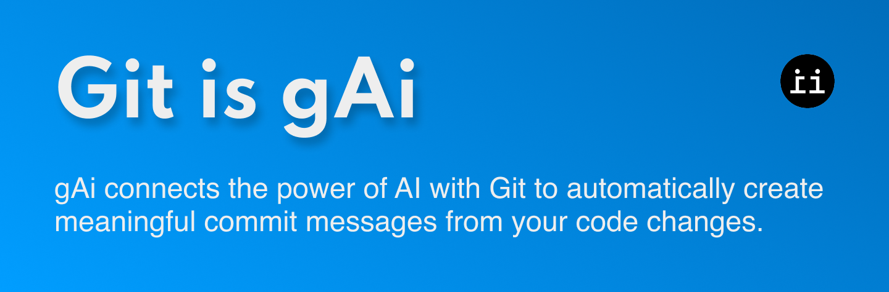

# gAi 🤖📝

A powerful CLI tool written in Rust that generates git commit messages using AI.

## 🦀 Overview

gAi connects the power of OpenAI with Git to automatically create meaningful commit messages from your code changes.

## 🔧 Setup

```bash
# Clone the repository
git clone https://github.com/yourusername/gai.git
cd gai

# Create .env file with your OpenAI API key
echo "OPENAI_API_KEY=your_openai_api_key_here" > .env

# Build the project
cargo build --release
```

## 🚀 Usage

```bash
# Generate a commit message from staged changes
gai --generate

# Generate and immediately commit
gai --commit

# Specify a different model
gai --generate --model gpt-4

# Adjust creativity (temperature)
gai --generate --temperature 1.2
```

## ⚙️ Requirements

- Rust and Cargo
- Git
- OpenAI API key

## 📋 License

MIT
