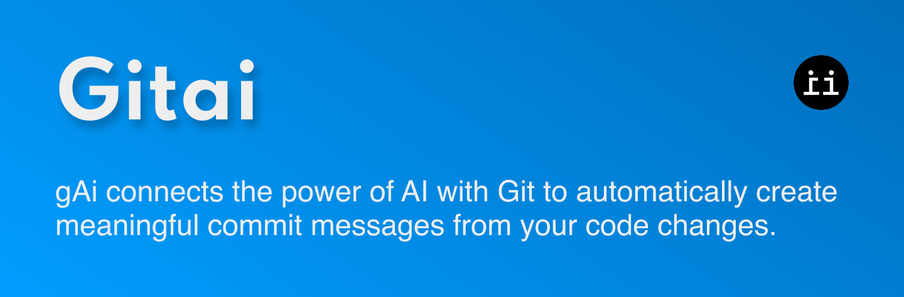

# gitai 🤖📝
[](https://github.com/tsoodo/gitai/actions/workflows/rust.yml)


**A powerful CLI tool written in Rust that generates git commit messages using AI.**

## 🦀 Overview

gitai connects the power of OpenAI with Git to automatically create meaningful commit messages from your code changes.

## 🔧 Setup

```bash
# Clone the repository
git clone https://github.com/tsoodo/gitai.git
cd gitai 

# Create .env file with your OpenAI API key
echo "OPENAI_API_KEY=your_openai_api_key_here" > .env

# Build the project
cargo build --release
```

## 🚀 Usage

```bash
# Generate a commit message from staged changes
gitai --generate

# Generate and immediately commit
gitai --commit

# Specify a different model
gitai --generate --model gpt-4

# Adjust creativity (temperature)
gitai --generate --temperature 1.2
```

---

## ⚙️ Requirements

- Rust and Cargo
- Git
- OpenAI API key

## 📋 License

MIT

## Disclaimer
i just found out today (**2025-05-24**) that some other guy literally already did this and with the same name. So heres a link to that lmao. 

[github](https://github.com/dpecos/gitai)
[lib.rs](https://lib.rs/crates/gitai)
